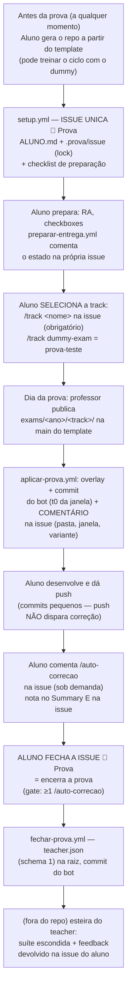

# exam-escola-ti — Sistema de provas (Escola de TI)

> [!IMPORTANT]
> Este é o **sistema de provas da Escola de TI** — modelo de repositório
> único: o esqueleto (issueops + correção) é estável e cada prova chega como
> pasta do ano (`exams/<ano>/<track>/`), aplicada por overlay no dia da prova.
> Material do docente (decisões, riscos, segredos, roteiros) vive no repo
> privado **`endersonmenezes/teacher-escola-ti`** (na raiz dele) — nada
> aqui é sigiloso.

## Sumário — quem é você?

- 🧑‍🏫 **Novo professor da Escola de TI — ou quer copiar/replicar o projeto?**
  Leia [O modelo](#o-modelo), [O ciclo de vida de uma prova](#o-ciclo-de-vida-de-uma-prova),
  [Configuração](#configuração-uma-vez) e [Estrutura](#estrutura). Para criar
  novas provas, veja o guia em [`docs/TRACKS.md`](docs/TRACKS.md). O material
  do docente (decisões, riscos, roteiros de operação) está no repo privado
  `endersonmenezes/teacher-escola-ti`.
- 🎓 **Aluno querendo conhecer o projeto / testar como é o dia da prova?**
  Vá direto para [Testar o ciclo completo (dummy)](#testar-o-ciclo-completo-dummy).
- ⚖️ **Quer entender as regras da prova (nota, janela, fontes, zeramento)?**
  Leia [`docs/REGRAS.md`](docs/REGRAS.md) e [Riscos conhecidos](#riscos-conhecidos-resumo).

## O modelo

Três camadas num único repositório **público**:

1. **Esqueleto ano-agnóstico** (sempre público): workflows (`setup`,
   `preparar-entrega`, `aplicar-prova`, `auto-correção`, `fechar-prova`),
   scripts base, `docs/REGRAS.md`, `docs/TRACKS.md`, `FONTES.md`, READMEs.
2. **Tracks** (sempre públicas e estáveis): o *tipo* de prova — originadas da
   disciplina em `talks/courses/escola-de-ti` (SDD, debugging, CRUD fullstack).
   O template traz a **prova-teste dummy** (`exams/dummy-exam/` — hello world
   em Python, **permanente** e fora da hierarquia de ano) e, quando publicadas,
   as pastas do ano vigente `exams/<ano>/<track>/`.
3. **Exams** (`exams/<ano>/<track>/`): cada pasta é uma prova **única**, com
   ano de aplicação próprio, selecionada pelo issueops no dia da prova. O
   conteúdo da pasta **é o repositório do aluno** no momento da aplicação
   (overlay na raiz: README, `contrato.json`, `rubrica.json`, `track.json`,
   stubs, testes). O esqueleto fica por trás, sustentando o issueops.

> [!WARNING]
> **Aplicar a pasta de ano errado zera a prova** — cada `exams/<ano>/` só
> deve estar publicado na `main` durante sua aplicação. Anos anteriores
> permanecem no histórico do repo, sempre disponíveis para consulta e
> evolução das próximas provas. A exceção permanente é o `exams/dummy-exam/`
> (fora da hierarquia de ano): ele fica publicado o tempo todo como
> prova-teste e **nunca entra na seleção sozinho quando há prova real
> publicada** — a aplicação trava até o `/track` explícito na issue.

> O `contrato.json` é o coração do modelo: por ser máquina-legível e detalhado,
> **a prova muda completamente de ano para ano mantendo apenas a track** —
> basta trocar a pasta do ano. O contrato **só existe após a aplicação**
> (`contrato.json` na raiz, vindo da pasta do ano) — a raiz do template é
> só esqueleto; o conteúdo de prova fica em `exams/` e é consumido pelo
> overlay (e validado pelo workflow *Validar exams* a cada push na main).

## O ciclo de vida de uma prova



No dia da prova real, o professor publica `exams/<ano>/<track>/` e **só a
prova real é aplicada**: a seleção é sempre explícita (`/track` na issue), e
com provas reais publicadas o dummy continua sendo só mais uma candidata —
nunca aplicado por engano. A prova se encerra quando **o aluno fecha a issue
🎯 Prova**: o workflow *Fechar prova* gera o `teacher.json` (schema 1) na
raiz, que é o handshake de entrega para a esteira de correção do professor
(repo privado `teacher-escola-ti`). A auto-correção é **sob demanda**
(`/auto-correcao` na issue ou dispatch — pushes não disparam) e o
*Fechar prova* **exige** ao menos 1 correção: sem o marcador de nota na
issue, ele reabre com aviso em vez de gerar o `teacher.json`.

- **Janela auto-ancorada**: a trampa T4 mede a janela a partir do commit
  "aplicar prova" + `janela_minutos` da rubrica — enforcement e divulgação
  usam o mesmo valor (a issue da prova divulga os minutos reais; dummy: 120).
- **Não é fork**: o repo gerado a partir do template **não tem vínculo de
  fork** com ele — por isso o sistema adiciona o remote `prova-template` e
  faz fetch/checkout no momento da listagem (setup/preparar) e da aplicação.
- **`/track` dispara a aplicação**: o comentário `/track <nome>` na issue
  aplica a prova **imediatamente** — pushes feitos com `GITHUB_TOKEN` (o bot)
  **não disparam workflows** (regra anti-recursão do GitHub), e o polling de
  10 min é o backstop.
- **Idempotência**: sentinela `.prova/aplicada-<pasta>` — o bot nunca aplica
  duas vezes.
- **Variante por repositório**: `scripts/variante.py` deriva os parâmetros do
  nome do repo + tabelas do `contrato.json` da pasta do ano; a correção
  recompute os mesmos valores.

## Configuração (uma vez)

> [!NOTE]
> Esta configuração é responsabilidade do **professor da disciplina** (dono do
> template e dos repos de aluno/organização). O aluno não configura nada —
> gera o repo a partir do template e segue o fluxo.

O fluxo do aluno precisa **apenas do `GITHUB_TOKEN` padrão** (o template é
público — fetch do template, overlay, issues e nota parcial funcionam sem
nenhuma configuração extra).

| Onde | O quê | Obrigatório? |
| --- | --- | --- |
| Repo → Settings → Variables | `TEMPLATE_URL` — default já aponta para `endersonmenezes/exam-escola-ti` | só para forks |
| Repo → Settings → Secrets/Vars | `CORRECAO_TOKEN` (PAT read-only) + `TEMPLATE_REPO` — endurecimento do tamper-check remoto T3 contra o template | **opcional** — sem eles o T3 fica desarmado (alerta, não zera) |
| Repo → Settings → Secrets/Vars | `CORRECAO_REPO` — repo da suíte escondida | **opcional** — ver abaixo |

> [!NOTE]
> **A suíte escondida NÃO roda no CI do repo do aluno.** A correção dela acontece
> em um dos dois modos, a critério do professor:
>
> - **Manual** — o professor baixa os repositórios dos alunos e executa a
>   correção fora do CI; ou
> - **Actions do repo teacher** — um sistema que roda no GitHub Actions do repo
>   privado `endersonmenezes/teacher-escola-ti`, do qual apenas a cópia ou o
>   relatório do resultado é disponibilizado aos alunos.
>
> Em ambos os modos vale a mesma transparência: os alunos têm como **verificar
> a data de criação dos testes** — a suíte existe **antes** da prova, então não
> há ajuste retroativo dos testes olhando as entregas. Já o conteúdo completo da
> suíte **não é publicado** (não entregamos todo o ouro).
>
> Por isso o job de testes escondidos faz **skip por design** quando
> `CORRECAO_TOKEN`/`CORRECAO_REPO` não estão configurados — isso **não é erro**.
> E a nota exibida no Summary do CI é **parcial** (testes públicos + checagens
> de entrega/trampas): a **nota definitiva** inclui a suíte escondida, apurada
> fora do CI do aluno.

## Testar o ciclo completo (dummy)

> 🎓 **Quer ver como funciona antes da prova?** Gere o seu repo a partir do
> template e siga o ciclo: na issue única "🎯 Prova", selecione a prova-teste
> com `/track dummy-exam` (a seleção é **sempre obrigatória**) — a prova é
> **aplicada automaticamente em seguida** (modo sandbox).

O `exams/dummy-exam/` é uma prova de teste de primeira classe **e permanente**:
serve para validar o sistema e treinar o ciclo de entrega em qualquer ano,
publicada na `main` o tempo todo, fora da hierarquia de ano.

**Seleção:** candidatas são o dummy + as tracks do ano vigente, e a escolha é
**sempre explícita**: comente `/track <nome>` na issue — `/track dummy-exam`
escolhe a prova-teste. Sem seleção, a aplicação **nem dispara** (no-op
silencioso); nome inválido trava com lembrete na própria issue. O comentário
`/track` **aplica a prova imediatamente** (pushes do bot com `GITHUB_TOKEN`
não disparam workflows — o comentário em si é o gatilho) — assim o dummy
nunca é aplicado por engano no dia de uma prova real.

**Teste A — professor/dono do template (você está em `endersonmenezes/`):**
1. Crie um repo de teste: `gh repo create prova-teste-meu-login --template endersonmenezes/exam-escola-ti --private` (ou o botão "Use this template"). O setup roda sozinho no push de criação: identidade, `ALUNO.md` e `README.md` com o botão "🎯 Iniciar a prova", e a **issue única "🎯 Prova"** (lock `.prova/issue`).
2. Complete o RA em `ALUNO.md` e marque os checkboxes na issue — *Preparar entrega* valida e responde na issue.
3. Comente `/track dummy-exam` na issue: o sistema valida, responde na hora e **aplica a prova-teste automaticamente** (overlay — `contrato.json` na raiz, README novo, `tests/public/` —, commit do bot = t0 da janela, comentário com a sua variante). Comentar "aplicar" na issue também força, se quiser antecipar.
4. Implemente algo em `src/` + `Containerfile` e dê push — **pushes não disparam
   correção**; quando quiser feedback, comente `/auto-correcao` na issue: a
   *Auto-correção* roda na hora (trampas + testes públicos) e a nota sai no
   Summary **e em comentário na issue**. Rode ao menos 1x — é requisito para
   fechar.
5. Feche a issue "🎯 Prova" — o *Fechar prova* gera o `teacher.json` na raiz
   (handshake de entrega). Fechar sem ter rodado `/auto-correcao` **reabre a
   issue com aviso**.

**Teste B — professor com fork (provar o sistema de ponta a ponta):**
1. Fork deste repo e registre a var `TEMPLATE_URL` apontando para **o seu fork**
   (Settings → Secrets and variables → Actions → Variables).
2. Em um repo gerado a partir do **seu fork**, siga os passos 2–5 do Teste A.
3. O overlay vai puxar a pasta do ano da **sua** `main` — publique
   `exams/<ano>/<track>/` lá quando quiser simular o dia da prova, e observe o
   `aplicar-prova` disparar sozinho (ou force com "aplicar" na issue).

## Riscos conhecidos (resumo)

- **Schedules desativam após 60 dias** sem atividade no repo do aluno —
  mitigado pelos gatilhos `push`/`issue_comment` e por criar os repos perto
  da prova.
- Aluno com `git fetch` manual no template antes da hora descobre, no máximo,
  os próprios parâmetros — impacto baixo por desenho.
- Detalhes completos, segredos e roteiros: repo privado do professor,
  **`endersonmenezes/teacher-escola-ti`** (material do docente na raiz dele).

## Estrutura

```
├── .github/workflows/    setup, preparar-entrega, aplicar-prova, auto-correção,
│                         fechar-prova (aluno fecha a issue -> teacher.json),
│                         validar-exams (só no template — valida exams/ a cada push)
├── scripts/
│   ├── variante.py       parâmetros da prova por nome de repo (lê contrato.json)
│   ├── prova_issue.py    helper da issue única "🎯 Prova" (lock .prova/issue)
│   ├── setup_prova.py    bootstrap (ALUNO.md + issue única + lock .prova/issue)
│   ├── preparar_entrega.py  valida a preparação e responde na issue
│   ├── aplicar_prova.py  selecao /track, overlay e comentário na issue
│   ├── fechar_prova.py   fecha a prova: gera teacher.json (schema 1) na raiz
│   ├── track_lock.py     lockfile track.json (liga/desliga jobs, CLI get/show/check)
│   ├── check_trampas.py  T2/T3/T4/T5 — identidade, autoria, janela, integridade
│   ├── check_entrega.py  critérios de entrega (Containerfile, README)
│   ├── rodar_testes.sh   build + sobe o container + pytest (testes públicos)
│   ├── score_publicos.py pontua o pytest a partir do log (peso da rubrica)
│   ├── nota.py           agrega result-*.json + Summary + comentário de nota
│   └── validar_exams.py  valida as pastas de exams/ (schema, colisões, tipos)
├── docs/REGRAS.md        regras comuns (nota, janela, fontes, zeramento)
├── docs/TRACKS.md        lockfile track.json + guia de nova track (para LLM)
├── exams/dummy-exam/     prova-teste PERMANENTE (hello world — fora da
│   │                     hierarquia de ano; candidata de seleção em qualquer ano)
│   ├── README.md         vira o README raiz do aluno (overlay)
│   ├── contrato.json     vira contrato raiz (endpoints, regras, variante)
│   ├── rubrica.json      vira rubrica raiz (pesos, extras, janela)
│   ├── track.json        vira lockfile raiz (liga workflows — docs/TRACKS.md)
│   ├── tests_publicos.py vira tests/public/test_publicos.py
│   ├── Containerfile, src/  stubs de entrega na raiz
│   └── AVISO-DUMMY.md    aviso interno (não vai para o repo do aluno)
├── exams/<ano>/<track>/  prova de um ano (só na main durante a aplicação)
├── tests/public/         placeholder — os testes chegam com a aplicação
├── .gitignore
└── FONTES.md             declaração de consultas do aluno
```
